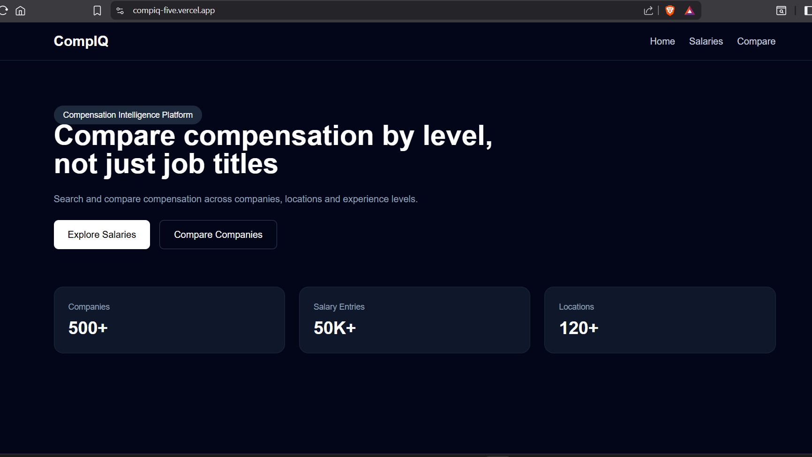
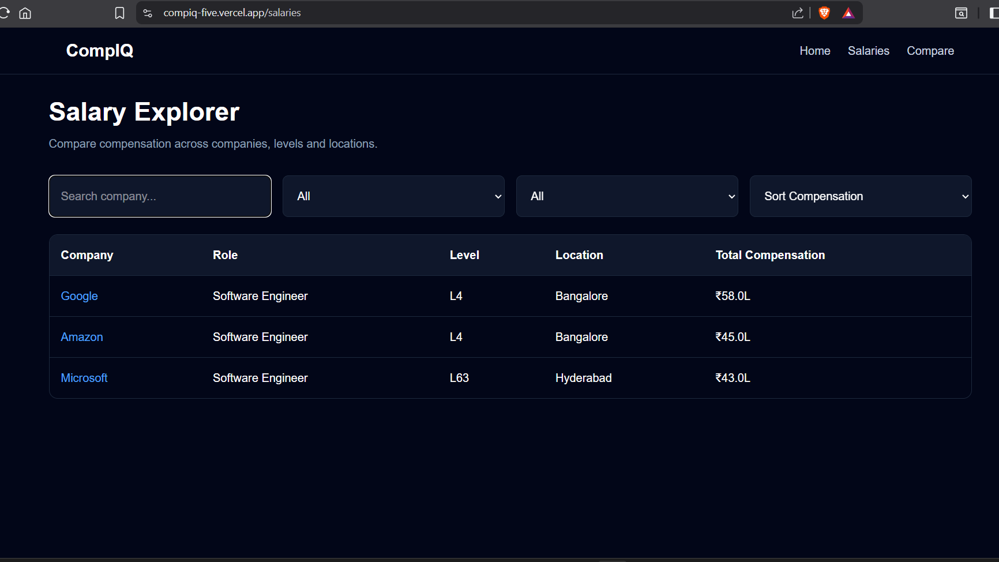
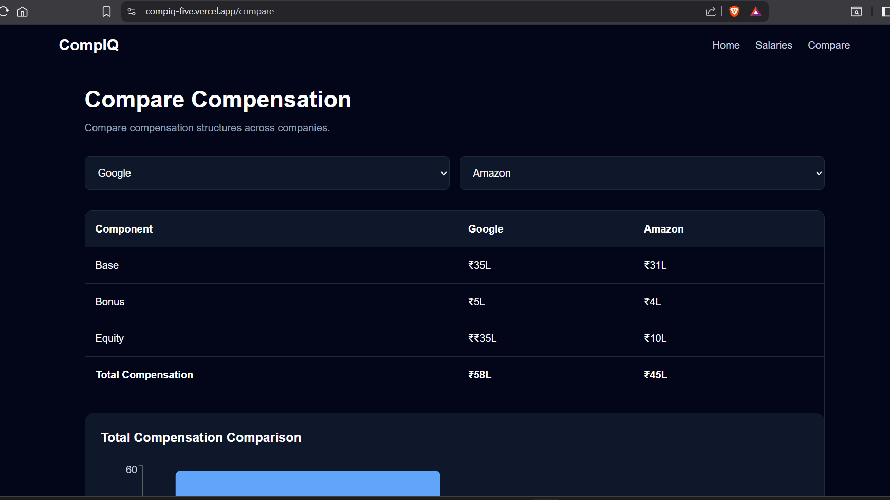
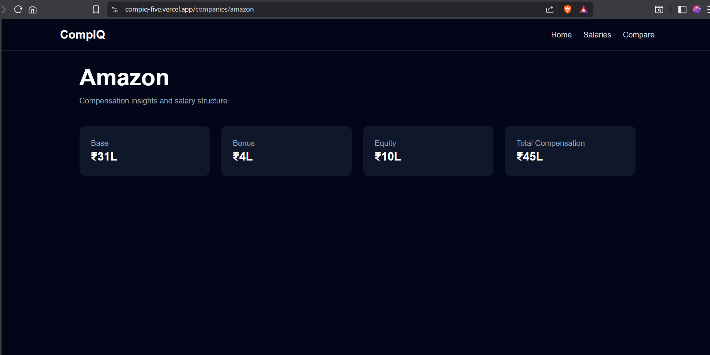

# CompIQ — Compensation Intelligence Platform

CompIQ is a compensation intelligence platform designed to help users compare compensation using structured salary data.

Unlike traditional salary listing platforms, CompIQ prioritizes:

- Levels over job titles
- Compensation structure analysis
- Structured salary comparison
- Company compensation insights

## Research Observations

| Feature | Levels.fyi | 6figr | AmbitionBox | Glassdoor | Implemented |
|-----------|-------------|--------|--------------|------------|-------------|
| Salary Search | ✓ | ✓ | ✓ | ✓ | ✓ |
| Level-based comparison | ✓ | Partial | Partial | Partial | ✓ |
| Compensation breakdown | ✓ | ✓ | Partial | Partial | ✓ |
| Company pages | ✓ | ✓ | ✓ | ✓ | ✓ |
| Visualization | ✓ | ✓ | Partial | Partial | ✓ |
| Company reviews | Limited | No | ✓ | ✓ | No |

## Features

### Salary Explorer
- Search by company
- Filter by location
- Filter by level
- Compensation sorting

### Comparison Interface
- Side-by-side company comparison
- Compensation breakdown:
  - Base pay
  - Bonus
  - Equity
  - Total compensation

### Company Pages
- Dynamic company routes
- Compensation metrics
- Structured compensation data

### Compensation Visualization
- Interactive charts
- Compensation insights generation

## Tech Stack

Frontend:
- Next.js
- React
- TypeScript
- TailwindCSS

Libraries:
- Zustand
- Recharts
- TanStack Table
- Framer Motion

## Screenshots

### Home Page



### Salary Explorer



### Compare Compensation



### Company Details



## Architecture Decisions

Data hierarchy:

Company → Role → Level → Location

Levels were prioritized over job titles because compensation varies significantly across levels despite similar titles across companies.

A reusable component architecture was adopted for scalability and maintainability.

## Future Improvements

- Real API integration
- Salary trend analysis
- Authentication
- Saved comparisons
- Large dataset virtualization

## Run locally

```bash
npm install
npm run dev
```